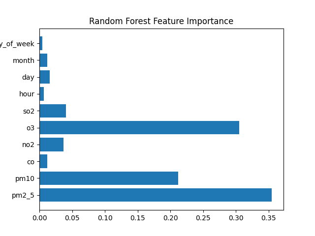

# 🌍 AQI Classification ML Project


A production-ready machine learning system that predicts Air Quality Index (AQI) levels using pollutant measurements and time-based features.

---

## 🚀 Live Application

🔗 **Streamlit Deployment:**  
https://aqi-ml-project-wiqqndruisijceapaz5vpf.streamlit.app/

This app allows users to input pollutant values and receive real-time AQI predictions using the trained Random Forest model.

---

## 📊 Dataset

- Source: OpenWeather Historical AQI API
- Total Records: 2,760
- Location: Colombo (Sri Lanka)
- Target Classes: AQI Levels 1–4

### Features Used

- pm2_5
- pm10
- co
- no2
- o3
- so2
- hour
- day
- month
- day_of_week

---

## ⚙️ Data Preprocessing Pipeline

✔ Timestamp feature extraction (hour, day, month, weekday)  
✔ Train/Test split (80/20, stratified)  
✔ SMOTE applied to balance training classes  
✔ StandardScaler applied (for Logistic Regression only)  
✔ Strict separation to prevent data leakage  

---

## 🤖 Models Trained

1. Logistic Regression (Linear Baseline)
2. Random Forest Classifier (Final Selected Model)

---

## 📈 Model Comparison

### 📊 Performance Summary

| Model                | Accuracy | Macro F1 Score |
|----------------------|----------|----------------|
| Logistic Regression  | 0.906    | 0.916          |
| Random Forest        | 0.998    | 0.999          |

Random Forest significantly outperformed Logistic Regression across all evaluation metrics and demonstrated superior class balance.

---

## 🌲 Random Forest Feature Importance



Top contributing pollutants:
- PM2.5
- PM10
- O3

---

## 📊 Accuracy Comparison


---

## 📊 Macro F1 Score Comparison


---

## 🔎 Confusion Matrices

### Logistic Regression


### Random Forest


---

## 📊 Class Distribution Analysis

### Original Dataset (Imbalanced)


### Balanced Training Data (After SMOTE)


---

## 🏆 Final Model Selection Rationale

Random Forest was selected as the production model because:

- Higher overall accuracy
- Higher macro F1 score (balanced performance across classes)
- Better minority class recall
- Ability to model non-linear pollutant interactions
- Strong generalization confirmed via shuffle (leakage) test

---

## 🧠 Data Leakage Prevention

To ensure robust evaluation:

- Train/Test split performed before SMOTE
- SMOTE applied only to training data
- Test data remained untouched
- Shuffle test performed to confirm absence of leakage

---

## 📁 Project Structure
# 🌍 AQI Classification ML Project


A production-ready Machine Learning system that predicts Air Quality Index (AQI) levels using pollutant measurements and time-based features.  

The final model is deployed publicly via Streamlit Cloud.

---

## 🚀 Live Application

🔗 **Streamlit Deployment:**  
https://aqi-ml-project-wiqqndruisijceapaz5vpf.streamlit.app/

Users can input pollutant values and receive real-time AQI classification predictions powered by a trained Random Forest model.

---

## 📊 Dataset

- Source: OpenWeather Historical AQI API
- Total Records: 2,760
- Location: Colombo, Sri Lanka
- Target Classes: AQI Levels 1–4

### Features Used

- pm2_5
- pm10
- co
- no2
- o3
- so2
- hour
- day
- month
- day_of_week

---

## ⚙️ Data Preprocessing Pipeline

✔ Timestamp feature extraction (hour, day, month, weekday)  
✔ Stratified Train/Test Split (80/20)  
✔ SMOTE applied to balance training classes  
✔ StandardScaler applied for Logistic Regression  
✔ Strict separation to prevent data leakage  

---

## 🤖 Models Trained

1. Logistic Regression (Baseline Linear Model)
2. Random Forest Classifier (Final Production Model)

---

## 📈 Model Comparison

### 📊 Performance Summary

| Model                | Accuracy | Macro F1 Score |
|----------------------|----------|----------------|
| Logistic Regression  | 0.906    | 0.916          |
| Random Forest        | 0.998    | 0.999          |

Random Forest significantly outperformed Logistic Regression across all evaluation metrics and demonstrated stronger class-wise balance.

---

## 🌲 Random Forest Feature Importance


Top contributing pollutants:
- PM2.5
- PM10
- O3

---

## 📊 Accuracy Comparison


---

## 📊 Macro F1 Score Comparison


---

## 🔎 Confusion Matrices

### Logistic Regression


### Random Forest


---

## 📊 Class Distribution Analysis

### Original Dataset (Imbalanced)


### Balanced Training Data (After SMOTE)


---

## 🏆 Final Model Selection Rationale

Random Forest was selected as the production model because:

- Higher overall accuracy
- Higher macro F1 score (balanced performance across classes)
- Better minority class recall
- Captures non-linear pollutant interactions
- Generalization validated using shuffle (leakage) test

---

## 🧠 Data Leakage Prevention

To ensure reliable evaluation:

- Train/Test split performed before SMOTE
- SMOTE applied only to training data
- Test data remained untouched
- Shuffle test confirmed no memorization

---

## 🛠 Deployment

- Model serialized using `joblib`
- Interactive UI built with Streamlit
- Hosted on Streamlit Cloud
- Dependencies managed via `requirements.txt`
- Version controlled using Git & GitHub

---

## 📁 Project Structure

```
aqi_ml_project/
│
├── data/
├── models/
│   ├── logistic_model.pkl
│   ├── random_forest_model.pkl
│   └── scaler.pkl
│
├── reports/
│   ├── accuracy_comparison.png
│   ├── f1_comparison.png
│   ├── confusion_matrix_logistic.png
│   ├── confusion_matrix_rf.png
│   ├── original_class_distribution.png
│   ├── balanced_training_distribution.png
│   ├── feature_importance_rf.png
│   └── model_performance.csv
│
├── src/
│   ├── ingestion.py
│   ├── preprocessing.py
│   ├── train.py
│   └── evaluate.py
│
├── app.py
├── requirements.txt
└── README.md
```

---

## 🧰 Tech Stack

- Python
- Scikit-learn
- Imbalanced-learn (SMOTE)
- Pandas
- NumPy
- Matplotlib
- Seaborn
- Streamlit
- Git & GitHub

---

## 📌 Key Learnings

- Handling imbalanced classification problems
- Preventing data leakage in ML pipelines
- Model comparison using macro evaluation metrics
- Feature importance interpretation
- Building production-ready ML systems
- Deploying ML applications to cloud platforms

---

## 🔮 Future Improvements

- Add cross-validation
- Hyperparameter tuning (GridSearchCV)
- Add XGBoost comparison
- Integrate live API inference
- Dockerize the application
- CI/CD pipeline for automated testing

---

### ⭐ If you found this project interesting, consider starring the repository!