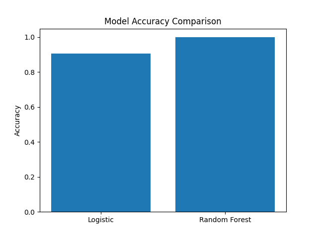
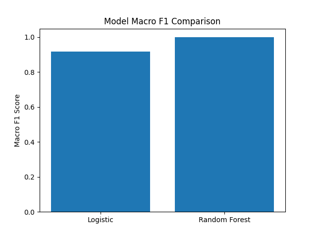
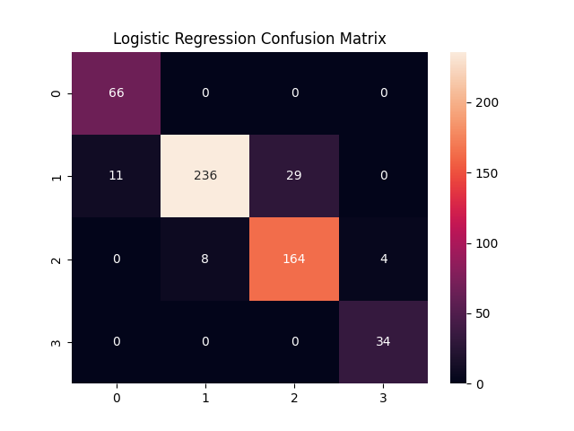
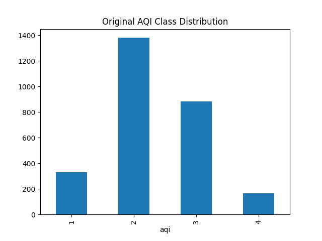
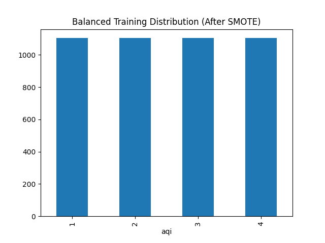

# 🌍 AQI Classification ML Project

A machine learning project that predicts Air Quality Index (AQI) levels using pollutant measurements and time-based features.

---

## 🚀 Live App

Streamlit App:
👉 https://aqi-ml-project-wiqqndruisijceapaz5vpf.streamlit.app/

---

## 📊 Dataset

- Historical AQI data from OpenWeather API
- 2760 records
- Features:
  - pm2_5
  - pm10
  - co
  - no2
  - o3
  - so2
  - hour
  - day
  - month
  - day_of_week
- Target: AQI (Classes 1–4)

---

## ⚙️ Preprocessing

- Extracted time features from timestamp
- Train-Test Split (80/20)
- SMOTE applied to balance training classes
- StandardScaler applied for Logistic Regression

---

## 🤖 Models Trained

1. Logistic Regression
2. Random Forest Classifier

---

## 📈 Model Comparison

### Accuracy Comparison



### Macro F1 Score Comparison



---

## 🔎 Confusion Matrices

### Logistic Regression



### Random Forest


---

## 📊 Class Distribution

### Original Dataset



### Balanced Training Data (SMOTE)



---

## 🏆 Final Model Selection

Random Forest selected because:

- Higher accuracy
- Higher macro F1 score
- Better per-class recall
- Captures non-linear relationships

---

## 📁 Project Structure

```
aqi_ml_project/
│
├── data/
├── models/
├── reports/
├── src/
├── app.py
├── requirements.txt
└── README.md
```

---

## 🛠 Tech Stack

- Python
- Scikit-learn
- Imbalanced-learn (SMOTE)
- Pandas
- Matplotlib
- Seaborn
- Streamlit

---

## 📌 Key Learnings

- Handling imbalanced classification
- Avoiding data leakage
- Model comparison using macro metrics
- Deploying ML models using Streamlit Cloud